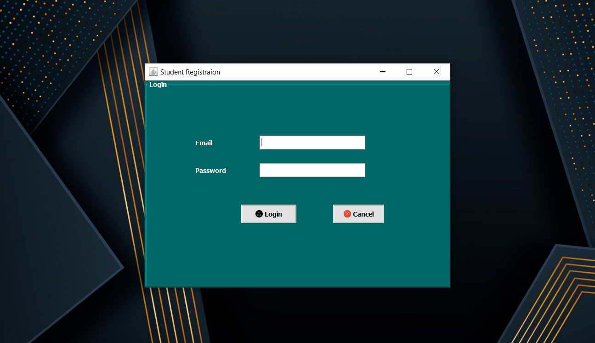
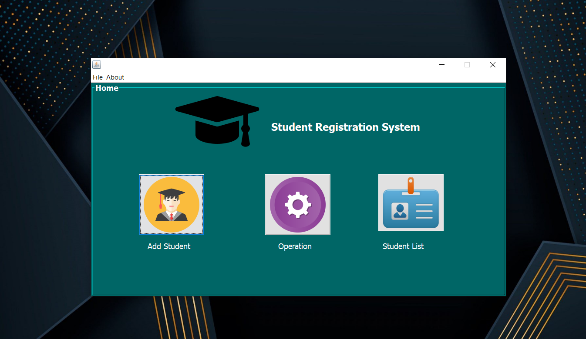
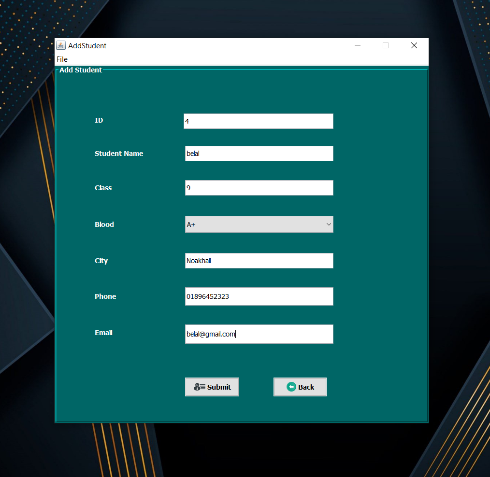
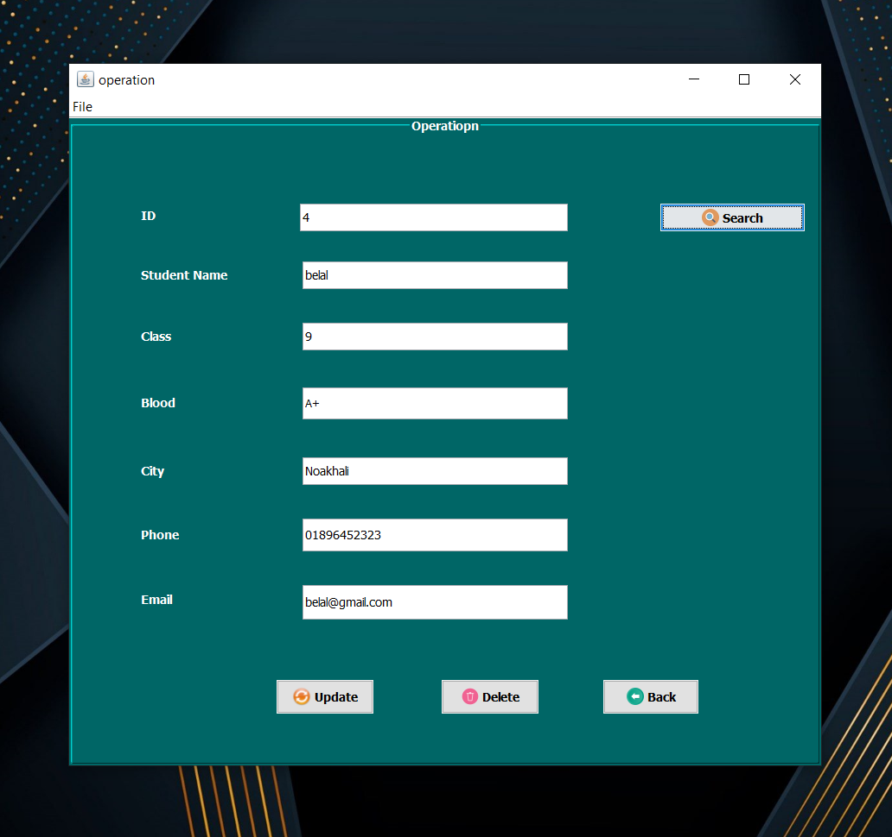
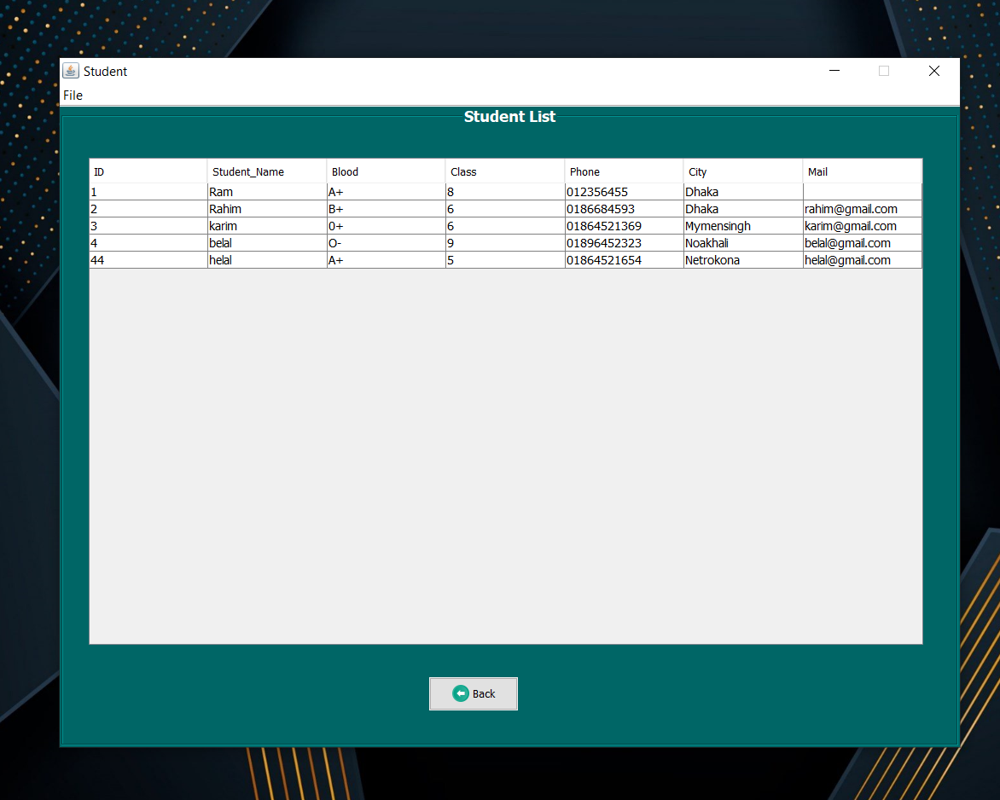

# JAVA swing project: University Admission Processes Desktop APP

<!-- &nbsp; -->

I did this project for own learning purpose.

# Features
* CRUD - create, read, update, delete operation with search option
* JDBC
* Desktop app with java swing
* Nice and easy to use with a suitable view.
* MySql database system

# Screenshots
> Login page

After running this project this login window will pop up.
Use 'abc' as username and password.

> Dashboard

From here, you can perform all operations like CRUD & search

> CRUD operation (Create)

> CRUD operation (RUD) with search

> Full Table View

# Requirements and Tools:
I did this project on Netbeans IDE.

You check this on your side. But You need to add two jar file. Make sure your my sql server is running and don't forget to import sql file on your "MySql server"

* mysql-connector-java-8.0.12.jar
* rs2xml.jar

Don't forget to resolve those issue by adding jar files.

# <a href="" ><strong>Project link</strong> </a>

---

<strong>made by Shuvo Saha Roy with 💕 and 🤘</strong>
